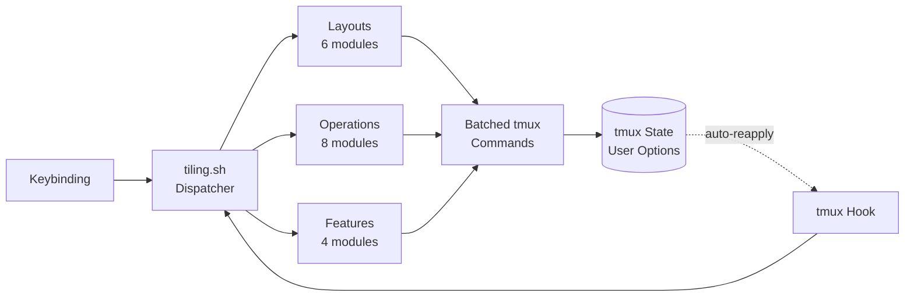

<div align="center">

<h1>tmux-tiling-revamped</h1>

<strong>BSP tiling window management for tmux. Six layouts, eight operations, zero dependencies.</strong>

<br>
<br>

[](https://github.com/gufranco/tmux-tiling-revamped/actions/workflows/tests.yml)
[](LICENSE)
[](https://github.com/tmux/tmux)
[](https://www.gnu.org/software/bash/)

</div>

---

**6** layouts  ·  **16** BSP orientations  ·  **8** operations  ·  **13** keybindings  ·  **116** tests  ·  **zero** dependencies

<table>
<tr>
<td width="50%" valign="top">

### BSP Tiling

Dwindle and spiral layouts with 16 orientation variants. Panes cascade into binary space partitions toward any corner, horizontally or vertically.

</td>
<td width="50%" valign="top">

### Auto-Reapplication

Hooks on split, kill, exit, and resize automatically reapply the current layout. A recursion guard prevents infinite hook chains.

</td>
</tr>
<tr>
<td width="50%" valign="top">

### Tree Operations

Rotate 90/180/270 degrees, flip horizontally or vertically, promote any pane to master, circulate pane positions forward or backward.

</td>
<td width="50%" valign="top">

### Named Scratchpads

Toggle persistent popup windows backed by detached tmux sessions. Multiple named scratchpads, each with configurable dimensions.

</td>
</tr>
<tr>
<td width="50%" valign="top">

### Pane Marks

Label any pane with a name and jump to it instantly. Uses fzf for fuzzy selection when available, direct name lookup otherwise.

</td>
<td width="50%" valign="top">

### Layout Presets

Save and restore named configurations that capture the layout, orientation flags, and master ratio. Switch between workflows in one keystroke.

</td>
</tr>
</table>

## Why

tmux has five built-in layouts. None of them do BSP tiling. The existing plugins each solve a piece of the puzzle but leave gaps.

| Capability | tiling-revamped | tmux-tilish | dwm.tmux | tmex |
|:-----------|:---------------:|:-----------:|:--------:|:----:|
| BSP layouts | Yes | No | No | No |
| Spiral trajectory | Yes | No | No | No |
| Auto-reapplication | Yes | Yes | No | No |
| Rotate / flip | Yes | No | No | No |
| Promote / demote | Yes | No | Yes | No |
| Named scratchpads | Yes | No | No | No |
| Pane marks | Yes | No | No | No |
| Layout presets | Yes | No | No | No |
| TPM installable | Yes | Yes | Yes | No |

## Architecture



All tmux commands from a single layout application are batched into one `tmux` invocation to prevent flicker. State is stored in tmux user options at window, pane, or global scope. No temp files, no external state.

## Layouts

### Dwindle

BSP cascade toward a corner. Each new pane takes half of the remaining space. The master pane holds the largest area, and subsequent panes get progressively smaller.

**2 panes**

```
┌───────────────────┬───────────────────┐
│                   │                   │
│                   │                   │
│         1         │         2         │
│                   │                   │
│                   │                   │
└───────────────────┴───────────────────┘
```

**3 panes**

```
┌───────────────────┬───────────────────┐
│                   │                   │
│                   │         2         │
│         1         │                   │
│                   ├───────────────────┤
│                   │                   │
│                   │         3         │
└───────────────────┴───────────────────┘
```

**4 panes**

```
┌───────────────────┬───────────────────┐
│                   │                   │
│                   │         2         │
│         1         │                   │
│                   ├─────────┬─────────┤
│                   │         │         │
│                   │    3    │    4    │
└───────────────────┴─────────┴─────────┘
```

**5 panes**

```
┌───────────────────┬───────────────────┐
│                   │         2         │
│                   │                   │
│         1         ├─────────┬─────────┤
│                   │         │    4    │
│                   │    3    ├─────────┤
│                   │         │    5    │
└───────────────────┴─────────┴─────────┘
```

### Spiral

Same BSP algorithm as dwindle, but the split direction rotates every few panes, creating a spiral convergence pattern instead of a straight cascade toward a corner.

**5 panes**

```
┌───────────────────┬───────────────────┐
│                   │         2         │
│                   │                   │
│         1         ├───────────────────┤
│                   │         3         │
│                   ├─────────┬─────────┤
│                   │    5    │    4    │
└───────────────────┴─────────┴─────────┘
```

Note how pane 5 appears to the left of pane 4. In the dwindle layout, pane 4 would be on top with 5 below. The spiral trajectory reverses the direction at that depth, creating the inward rotation.

### Grid

Even N x M grid. Uses tmux's built-in tiled layout for fair distribution.

**4 panes**

```
┌───────────────────┬───────────────────┐
│                   │                   │
│         1         │         2         │
│                   │                   │
├───────────────────┼───────────────────┤
│                   │                   │
│         3         │         4         │
│                   │                   │
└───────────────────┴───────────────────┘
```

**6 panes**

```
┌────────────┬─────────────┬────────────┐
│            │             │            │
│     1      │      2      │     3      │
│            │             │            │
├────────────┼─────────────┼────────────┤
│            │             │            │
│     4      │      5      │     6      │
│            │             │            │
└────────────┴─────────────┴────────────┘
```

### Main-Center

Wide center pane for the primary task, narrow side panes for secondary content. The center ratio is configurable via `@tiling_revamped_main_center_ratio`.

**3 panes**

```
┌───────┬───────────────────────┬───────┐
│       │                       │       │
│       │                       │       │
│   2   │           1           │   3   │
│       │                       │       │
│       │                       │       │
└───────┴───────────────────────┴───────┘
```

**5 panes**

```
┌───────┬───────────────────────┬───────┐
│       │                       │   3   │
│       │                       ├───────┤
│   2   │           1           │   4   │
│       │                       ├───────┤
│       │                       │   5   │
└───────┴───────────────────────┴───────┘
```

### Monocle

Zoom the focused pane to fill the entire window. Other panes are hidden behind the zoom. Press the same key again to toggle back to the previous layout.

```
┌───────────────────────────────────────┐
│                                       │
│                                       │
│               1 [zoom]                │
│                                       │
│                                       │
│                                       │
└───────────────────────────────────────┘
        panes 2, 3, 4 behind zoom
```

### Deck

All panes at full height, side by side at equal widths. Each pane is a "card" in the deck.

**3 panes**

```
┌────────────┬─────────────┬────────────┐
│            │             │            │
│            │             │            │
│     1      │      2      │     3      │
│            │             │            │
│            │             │            │
└────────────┴─────────────┴────────────┘
```

## BSP Orientation Flags

The dwindle and spiral layouts accept a 4-character orientation string that controls where panes cascade. Default: `brvc`.

| Position | Options | Meaning |
|:---------|:--------|:--------|
| 1 | `t` / `b` | Top or bottom corner |
| 2 | `l` / `r` | Left or right corner |
| 3 | `h` / `v` | Horizontal or vertical branch direction |
| 4 | `c` / `s` | Corner or spiral trajectory |

This produces 16 distinct arrangements. Here are the four most visually distinct variants with 4 panes:

**`brvc`** bottom-right, vertical, corner (default)

```
┌───────────┬───────────┐
│           │     2     │
│     1     ├─────┬─────┤
│           │  3  │  4  │
└───────────┴─────┴─────┘
```

**`tlvc`** top-left, vertical, corner

```
┌─────┬─────┬───────────┐
│  4  │  3  │           │
├─────┴─────┤     1     │
│     2     │           │
└───────────┴───────────┘
```

**`brhc`** bottom-right, horizontal, corner

```
┌───────────────────────┐
│           1           │
├───────────┬───────────┤
│           │     3     │
│     2     ├───────────┤
│           │     4     │
└───────────┴───────────┘
```

**`blvc`** bottom-left, vertical, corner

```
┌───────────┬───────────┐
│     2     │           │
├─────┬─────┤     1     │
│  4  │  3  │           │
└─────┴─────┴───────────┘
```

## Operations

### Promote

Swap the focused pane with the master pane. If the focused pane is already master, demote it to position 2.

**Before** - pane C is focused:

```
┌───────────┬───────────┐
│           │     B     │
│     A     ├─────┬─────┤
│           │ [C] │  D  │
└───────────┴─────┴─────┘
```

**After** - pane C is now master:

```
┌───────────┬───────────┐
│           │     B     │
│     C     ├─────┬─────┤
│           │  A  │  D  │
└───────────┴─────┴─────┘
```

### Rotate

Rotate the BSP orientation by 90, 180, or 270 degrees. This swaps the branch direction between vertical and horizontal splits.

**Before** `brvc` - vertical branches:

```
┌───────────┬───────────┐
│           │     2     │
│     1     ├─────┬─────┤
│           │  3  │  4  │
└───────────┴─────┴─────┘
```

**After** `brhc` - rotated 90, horizontal branches:

```
┌───────────────────────┐
│           1           │
├───────────┬───────────┤
│           │     3     │
│     2     ├───────────┤
│           │     4     │
└───────────┴───────────┘
```

### Flip

Mirror the layout along one axis. Flip horizontal swaps left/right, flip vertical swaps top/bottom.

**Before** `brvc` - cascade toward bottom-right:

```
┌───────────┬───────────┐
│           │     2     │
│     1     ├─────┬─────┤
│           │  3  │  4  │
└───────────┴─────┴─────┘
```

**After** `blvc` - flipped horizontal, cascade toward bottom-left:

```
┌───────────┬───────────┐
│     2     │           │
├─────┬─────┤     1     │
│  4  │  3  │           │
└─────┴─────┴───────────┘
```

### Circulate

Shift all pane contents one position forward or backward through the layout slots. The layout topology stays the same, only the content moves.

**Before:**

```
┌───────────┬───────────┐
│           │     B     │
│     A     ├─────┬─────┤
│           │  C  │  D  │
└───────────┴─────┴─────┘
```

**After** circulate next:

```
┌───────────┬───────────┐
│           │     A     │
│     D     ├─────┬─────┤
│           │  B  │  C  │
└───────────┴─────┴─────┘
```

### Balance

Equalize all pane sizes while preserving the current layout topology.

**Before** - uneven sizes:

```
┌──────────────────┬────┐
│                  │ 2  │
│        1         ├──┬─┤
│                  │3 │4│
└──────────────────┴──┴─┘
```

**After** - balanced:

```
┌───────────┬───────────┐
│           │     2     │
│     1     ├─────┬─────┤
│           │  3  │  4  │
└───────────┴─────┴─────┘
```

### Equalize

Ignore the current layout and distribute all panes evenly along one axis.

```
┌───────────────────────┐
│           1           │
├───────────────────────┤
│           2           │
├───────────────────────┤
│           3           │
├───────────────────────┤
│           4           │
└───────────────────────┘
```

### Autosplit

Split the focused pane along its longest axis. Wide panes split horizontally, tall panes split vertically.

**Wide pane** - splits horizontally:

```
┌─────────────────────┐      ┌──────────┬──────────┐
│                     │      │          │          │
│     wide pane       │  ->  │   left   │  right   │
│                     │      │          │          │
└─────────────────────┘      └──────────┴──────────┘
```

**Tall pane** - splits vertically:

```
┌──────────┐      ┌──────────┐
│          │      │   top    │
│   tall   │  ->  ├──────────┤
│   pane   │      │  bottom  │
│          │      │          │
└──────────┘      └──────────┘
```

### Focus-Resize

When enabled, the focused pane automatically expands toward the golden ratio on every focus change. Other panes shrink proportionally.

**Before** - pane 3 receives focus:

```
┌───────────┬───────────┐
│           │     2     │
│     1     ├─────┬─────┤
│           │ [3] │  4  │
└───────────┴─────┴─────┘
```

**After** - pane 3 expanded to 62% ratio:

```
┌──────┬────────────────┐
│      │       2        │
│  1   ├────────────┬───┤
│      │    [3]     │ 4 │
└──────┴────────────┴───┘
```

## Features

### Layout Cycling

Step forward or backward through a configurable list of layouts. The cycle order is set via `@tiling_revamped_cycle_layouts`.

```
prefix+o     prefix+o     prefix+o     prefix+o     prefix+o
dwindle  -->  spiral  -->   grid   --> main-center --> monocle  --+
   ^                                                              |
   +--------------------------------------------------------------+
```

### Pane Marks

Label any pane with a name. Jump to any marked pane with fzf fuzzy selection or by name.

```
┌───────────────────┬───────────────────┐
│                   │                   │
│   mark: build     │   mark: editor    │
│                   ├─────────┬─────────┤
│                   │         │  mark:  │
│                   │         │   log   │
└───────────────────┴─────────┴─────────┘

  prefix + M  -->  set mark on focused pane
  prefix + j  -->  fzf picker to jump to any mark
```

### Named Scratchpads

Toggle floating popup windows backed by persistent tmux sessions. Each scratchpad keeps its state between toggles. Requires tmux 3.2+ for `display-popup`.

```
┌───────────────────────────────────────┐
│                                       │
│   ┌───────────────────────────────┐   │
│   │                               │   │
│   │      scratchpad: htop         │   │
│   │                               │   │
│   │   (persistent popup session)  │   │
│   │                               │   │
│   └───────────────────────────────┘   │
│                                       │
│       underlying panes still run      │
└───────────────────────────────────────┘
```

### Layout Presets

Save the current layout, orientation, and master ratio as a named preset. Restore it later to switch between workflows instantly.

```
  save "dev"                              apply "dev"

  ┌───────────┬───────────┐               ┌───────────┬───────────┐
  │           │     2     │   preset      │           │     2     │
  │     1     ├─────┬─────┤   -------->   │     1     ├─────┬─────┤
  │           │  3  │  4  │   dwindle     │           │  3  │  4  │
  └───────────┴─────┴─────┘   brvc:60     └───────────┴─────┴─────┘
```

## Quick Start

### Prerequisites

| Tool | Version | Install |
|:-----|:--------|:--------|
| tmux | 3.2+ | [github.com/tmux/tmux](https://github.com/tmux/tmux) |
| bash | 4.0+ | Ships with Linux. macOS: `brew install bash` |
| TPM | latest | [github.com/tmux-plugins/tpm](https://github.com/tmux-plugins/tpm) |
| fzf | any | Optional. Enables fuzzy mark/preset selection |

### Install

Add to `~/.tmux.conf`:

```tmux
set -g @plugin 'gufranco/tmux-tiling-revamped'
```

Press `prefix + I` to install via TPM.

### Verify

Open tmux, create a few panes, then press `prefix + d`. All panes rearrange into a dwindle layout.

## Default Keybindings

All keybindings use the tmux prefix. Every key is configurable via `@tiling_revamped_key_*` options.

| Key | Action | Command |
|:----|:-------|:--------|
| `d` | Apply dwindle layout | `layout dwindle` |
| `D` | Apply spiral layout | `layout spiral` |
| `b` | Balance panes | `balance` |
| `B` | Equalize panes | `equalize` |
| `m` | Promote focused pane to master | `promote` |
| `.` | Rotate layout 90 degrees | `rotate` |
| `,` | Flip layout horizontally | `flip` |
| `C-r` | Circulate panes | `circulate` |
| `C-d` | Smart split along longest axis | `autosplit` |
| `o` | Cycle to next layout | `cycle` |
| `M` | Mark pane with a name | `mark <name>` |
| `j` | Jump to marked pane | `jump` |
| `g` | Toggle scratchpad popup | `scratchpad` |

## Configuration

All options use the `@tiling_revamped_` prefix.

### Behavior

| Option | Default | Description |
|:-------|:--------|:------------|
| `@tiling_revamped_auto_apply` | `1` | Reapply layout when panes are added or removed |
| `@tiling_revamped_default_orientation` | `brvc` | Default BSP orientation for new windows |
| `@tiling_revamped_focus_resize` | `0` | Expand focused pane toward golden ratio on focus |
| `@tiling_revamped_focus_ratio` | `62` | Percentage of window for focused pane |
| `@tiling_revamped_main_center_ratio` | `60` | Width percentage for main-center center pane |
| `@tiling_revamped_cycle_layouts` | `dwindle spiral grid main-center monocle` | Layout cycle order |
| `@tiling_revamped_scratch_width` | `80%` | Scratchpad popup width |
| `@tiling_revamped_scratch_height` | `75%` | Scratchpad popup height |
| `@tiling_revamped_enable_logging` | `0` | Write debug logs to `~/.tmux/tiling-logs/` |

### Custom Keybindings

```tmux
set -g @tiling_revamped_key_dwindle    "d"
set -g @tiling_revamped_key_spiral     "D"
set -g @tiling_revamped_key_balance    "b"
set -g @tiling_revamped_key_equalize   "B"
set -g @tiling_revamped_key_promote    "m"
set -g @tiling_revamped_key_rotate     "."
set -g @tiling_revamped_key_flip       ","
set -g @tiling_revamped_key_circulate  "C-r"
set -g @tiling_revamped_key_autotile   "C-d"
set -g @tiling_revamped_key_cycle      "o"
set -g @tiling_revamped_key_mark       "M"
set -g @tiling_revamped_key_jump       "j"
set -g @tiling_revamped_key_scratchpad "g"
```

### i3-style Alt Keybindings

To use Alt-based bindings without the prefix:

```tmux
bind -n M-d run-shell "~/.tmux/plugins/tmux-tiling-revamped/src/tiling.sh layout dwindle"
bind -n M-D run-shell "~/.tmux/plugins/tmux-tiling-revamped/src/tiling.sh layout spiral"
bind -n M-g run-shell "~/.tmux/plugins/tmux-tiling-revamped/src/tiling.sh layout grid"
bind -n M-m run-shell "~/.tmux/plugins/tmux-tiling-revamped/src/tiling.sh promote"
bind -n M-o run-shell "~/.tmux/plugins/tmux-tiling-revamped/src/tiling.sh cycle"
bind -n M-e run-shell "~/.tmux/plugins/tmux-tiling-revamped/src/tiling.sh autosplit"
```

## CLI

The dispatcher at `src/tiling.sh` accepts direct commands for scripting and custom bindings.

```bash
# Layouts
./src/tiling.sh layout dwindle brvc
./src/tiling.sh layout spiral
./src/tiling.sh layout grid
./src/tiling.sh layout main-center
./src/tiling.sh layout monocle
./src/tiling.sh layout deck

# Operations
./src/tiling.sh balance
./src/tiling.sh equalize
./src/tiling.sh rotate 180
./src/tiling.sh flip v
./src/tiling.sh promote
./src/tiling.sh circulate prev
./src/tiling.sh autosplit
./src/tiling.sh focus-resize

# Features
./src/tiling.sh cycle next
./src/tiling.sh mark editor
./src/tiling.sh jump editor
./src/tiling.sh scratchpad htop
./src/tiling.sh preset save dev
./src/tiling.sh preset apply dev
```

## How It Works

The core BSP algorithm is ported from sunaku's tmux-layout-dwindle. Three passes run inside a single batched `tmux` invocation:

**Step 1: Flatten** - stack all panes vertically via `select-layout even-vertical`:

```
┌───────────────────────────────────────┐
│                  1                    │
├───────────────────────────────────────┤
│                  2                    │
├───────────────────────────────────────┤
│                  3                    │
├───────────────────────────────────────┤
│                  4                    │
└───────────────────────────────────────┘
```

**Step 2: Rearrange** - each pane moves the next pane beside it via `move-pane` with orientation-aware flags:

```
┌───────────────────┬───────────────────┐
│                   │         2         │
│         1         ├─────────┬─────────┤
│                   │    3    │    4    │
└───────────────────┴─────────┴─────────┘
```

**Step 3: Size** - binary-halve each branch so sizes cascade from master to leaf:

```
┌──────────────────────────┬────────────┐
│                          │     2      │
│            1             ├──────┬─────┤
│                          │  3   │  4  │
└──────────────────────────┴──────┴─────┘
```

State is stored in tmux user options:

| Option | Scope | Purpose |
|:-------|:------|:--------|
| `@tiling_revamped_layout` | window | Current layout name |
| `@tiling_revamped_orientation` | window | BSP orientation flags |
| `@tiling_revamped_applying` | global | Recursion guard |
| `@tiling_revamped_mark` | pane | Mark name |
| `@tiling_revamped_marks` | global | Mark index |

Auto-reapplication uses hook arrays at index 100 to avoid colliding with other plugins.

<details>
<summary><strong>Project structure</strong></summary>

```
tmux-tiling-revamped.tmux     # TPM entry point: keybindings and hooks
src/
  tiling.sh                   # Command dispatcher
  lib/
    layouts/
      dwindle.sh              # BSP dwindle + shared _apply_bsp_layout
      spiral.sh               # BSP spiral (delegates to dwindle)
      grid.sh                 # Even grid via tmux tiled
      main-center.sh          # Wide center pane with side columns
      monocle.sh              # Zoom toggle
      deck.sh                 # Full-height equal-width stack
    operations/
      balance.sh              # Equalize sizes within current topology
      equalize.sh             # Force even distribution
      rotate.sh               # Rotate orientation 90/180/270
      flip.sh                 # Mirror horizontally or vertically
      promote.sh              # Swap focused pane with master
      circulate.sh            # Shift pane positions
      autosplit.sh            # Smart split along longest axis
      focus-resize.sh         # Golden ratio resize on focus
    features/
      marks.sh                # Named pane labels with fzf jump
      scratchpad.sh           # Persistent popup sessions
      presets.sh              # Save and restore layout configs
      cycle.sh                # Step through layout list
    tmux/
      tmux-ops.sh             # Get/set tmux options at all scopes
      tmux-config.sh          # Option helpers: enabled, numeric, guards
    utils/
      constants.sh            # Readonly option names and defaults
      error-logger.sh         # Rotating log file
      has-command.sh           # Command existence check
test/
  helpers.bash                # Mock tmux for unit tests
  tmux_helpers.bash           # Real tmux server for integration tests
  lib/                        # 15 bats test files mirroring src/lib/
examples/
  minimal.tmux.conf           # Drop-in config with defaults
  power-user.tmux.conf        # Full config with all options
```

</details>

## Development

| Command | Description |
|:--------|:------------|
| `make test` | Run the full 116-test bats suite |
| `make test-unit` | Run unit tests only |
| `make lint` | ShellCheck all shell files |
| `make clean` | Remove temp test artifacts |

## License

[MIT](LICENSE)
